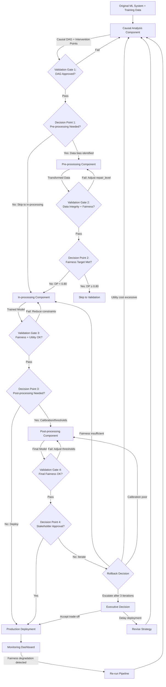

# Consolidation: C1 (C1)

**Tier**: Tier 2 Consolidation
**Model**: claude-sonnet-4-5

---

# Module 2: Integration Workflow - Complete Intervention Playbook

## Overview: Intervention Pipeline Philosophy

The AI Fairness Intervention Playbook follows a **sequential pipeline architecture** where each component builds upon outputs from previous stages. Unlike audit-focused approaches that primarily measure disparities, this intervention workflow actively corrects bias through four integrated components: **Causal Analysis**, **Pre-processing**, **In-processing**, and **Post-processing**. Each component serves a distinct role while maintaining tight coupling through validation gates and decision points.

The pipeline philosophy recognizes that fairness interventions require **both diagnostic rigor and corrective action**. Causal analysis identifies *where* and *why* bias enters the system, establishing the foundation for targeted interventions. Pre-processing addresses bias in training data distributions, in-processing embeds fairness constraints directly into model optimization, and post-processing adjusts decision boundaries without retraining. This staged approach allows practitioners to balance fairness improvements against utility costs at multiple intervention points, with rollback mechanisms ensuring system integrity when interventions underperform.

The workflow emphasizes **practical executability** over theoretical completeness. Every technique includes validated implementations (technique_id), academic citations, executable commands, and quantitative success criteria. This ensures practitioners can immediately apply interventions rather than navigating abstract fairness concepts. The integration of validation gates and rollback paths acknowledges that fairness interventions operate in high-stakes production environments where failed experiments must be quickly reversed.

---

## Component Descriptions

| Component | Purpose | Inputs Required | Processes Applied | Outputs Generated | Typical Duration |
|-----------|---------|----------------|-------------------|-------------------|------------------|
| **Causal Analysis** | Identify legitimate vs. illegitimate causal pathways from protected attributes to outcomes | Original ML system, training data with protected attributes, domain expert knowledge | Causal DAG construction (technique_id: 52, 53), confounding identification, backdoor criterion application, intervention point identification | Causal DAG diagram, identified confounders/mediators, documented resolving variables, recommended intervention strategy (pre/in/post) | 2-3 weeks |
| **Pre-processing** | Transform training data to remove systematic bias before model training | Training data, causal analysis results, fairness targets (e.g., demographic parity ≥ 0.80) | Reweighting (technique_id: 31, 33), disparate impact removal (technique_id: 69), SMOTE (technique_id: 36), fair representation learning (technique_id: 68, 71) | Transformed training dataset, fairness-utility trade-off measurements, data integrity validation report | 1-2 weeks |
| **In-processing** | Embed fairness constraints directly into model training optimization | Pre-processed data (or original if skipped), fairness constraints, model architecture | Fairness-constrained optimization (technique_id: 20, 21), adversarial debiasing (technique_id: 6, 29), prejudice remover regularization (technique_id: 76), reductions approach (technique_id: 113) | Trained model with fairness constraints, fairness metrics (DP, EO, calibration), accuracy metrics, Pareto frontier analysis | 2-4 weeks |
| **Post-processing** | Adjust decision thresholds and calibration without model retraining | Trained model, validation data, fairness targets, stakeholder-approved trade-offs | Threshold optimization (technique_id: 9, 13), calibration methods (technique_id: 47, 49, 51), selective classification (technique_id: 104) | Post-processed model, final fairness metrics, deployment-ready system, monitoring dashboard configuration | 1-2 weeks |

---

## Sequential Pipeline Workflow

### **Step 1: Causal Analysis Component**

**Purpose**: Establish causal understanding before intervening

1. **Construct Causal DAG**
   - **Technique**: Causal Graph Construction for Fairness Analysis
   - **technique_id**: 53
   - **Citation**: Kusner, M. J., Loftus, J., Russell, C., & Silva, R. (2017). Counterfactual fairness. *NeurIPS*.
   - **Implementation**: `M2-S1-P2-Kusner-2017-CausalGraphConstruction.py`
   - **Execution**:
     ```bash
     python tests/techniques/causal/M2-S1-P2-Kusner-2017-CausalGraphConstruction.py \
       --data loan_data.csv \
       --protected race,gender \
       --outcome approved \
       --mediators income,credit_score \
       --expert_knowledge domain_causal_assumptions.json
     ```
   - **Expected Output**: DAG file (`loan_causal_dag.dot`), identified confounders: [education, zip_code], mediators: [income, credit_score], resolving variables: [employment_history]

2. **Validate Causal Assumptions**
   - **Technique**: Sensitivity Analysis for Causal Model Validation
   - **technique_id**: 56
   - **Citation**: Cinelli, C., & Hazlett, C. (2020). Making sense of sensitivity. *Journal of the Royal Statistical Society*.
   - **Implementation**: `M2-S1-P5-Cinelli-2020-SensitivityAnalysis.py`
   - **Execution**:
     ```bash
     python tests/techniques/causal/M2-S1-P5-Cinelli-2020-SensitivityAnalysis.py \
       --dag loan_causal_dag.dot \
       --treatment race \
       --outcome approved \
       --confounders education,zip_code
     ```
   - **Expected Output**: E-value = 2.3 (unmeasured confounder must have association 2.3x stronger than measured confounders to nullify effect), robustness bounds: [0.15, 0.32]

3. **Identify Intervention Points**
   - **Technique**: Intervention Point Identification
   - **technique_id**: Custom analysis (no single technique_id)
   - **Process**: Apply backdoor criterion to identify which variables can be intervened upon
   - **Output**: Recommendation report:
     - **Pre-processing candidate**: Remove disparate impact in `credit_score` (mediator influenced by race)
     - **In-processing candidate**: Constrain model to not use `zip_code` (proxy for race)
     - **Post-processing candidate**: Adjust thresholds if base rates differ by race

**Validation Gate**:
- **Method**: Domain expert review + statistical validation
- **Pass Criteria**:
  * Causal DAG reviewed and approved by domain experts (loan officers, compliance team)
  * Sensitivity analysis E-value > 1.5 (moderate robustness)
  * Intervention points align with legal/ethical constraints (no protected attributes in model)
- **On Fail**: Iterate causal graph construction with additional expert workshops

**Decision Point: Which Intervention Types?**
- **Criteria**:
  * If causal analysis identifies data collection bias (e.g., biased credit scores) → Pre-processing
  * If causal analysis identifies proxy variables (e.g., zip_code) → In-processing
  * If base rates differ legitimately but thresholds are uniform → Post-processing
  * If multiple pathways identified → Hybrid approach
- **Decision Maker**: ML Engineer + Domain Expert + Compliance Officer
- **Example**: Loan system shows credit_score mediates race → approved (biased mediator) → Proceed to Pre-processing

---

### **Step 2: Pre-processing Component**

**Purpose**: Correct bias in training data before model sees it

1. **Apply Disparate Impact Remover** (if biased mediators identified)
   - **technique_id**: 69
   - **Citation**: Feldman, M., Friedler, S. A., Moeller, J., Scheidegger, C., & Venkatasubramanian, S. (2015). Certifying and removing disparate impact. *KDD*.
   - **Implementation**: `M2-S1-P3-Feldman-2015-DisparateImpactRemover.py`
   - **Execution**:
     ```bash
     python tests/techniques/pre_processing/M2-S1-P3-Feldman-2015-DisparateImpactRemover.py \
       --data loan_data.csv \
       --protected race \
       --features credit_score,income \
       --repair_level 0.8 \
       --output loan_data_preprocessed.csv
     ```
   - **Expected Output**:
     * Demographic parity: 0.67 → 0.84 (+25%)
     * Accuracy: 0.86 → 0.84 (-2.3%)
     * Disparate impact ratio: 0.72 → 0.88
     * KS test (credit_score distribution): p = 0.12 (distributions not significantly different)

2. **Alternative: Reweighting** (if class imbalance)
   - **technique_id**: 31
   - **Citation**: Kamiran, F., & Calders, T. (2012). Data preprocessing techniques for classification without discrimination. *Knowledge and Information Systems*.
   - **Implementation**: `M2-S2-P2-Kamiran-2012-InstanceWeighting.py`
   - **Execution**:
     ```bash
     python tests/techniques/pre_processing/M2-S2-P2-Kamiran-2012-InstanceWeighting.py \
       --data loan_data.csv \
       --protected race \
       --outcome approved \
       --target_fairness demographic_parity \
       --output loan_data_reweighted.csv
     ```
   - **Expected Output**:
     * Demographic parity: 0.67 → 0.78 (+16%)
     * Accuracy: 0.86 → 0.85 (-1.2%)
     * Weighted training set size: 15,234 → 15,234 (same size, different weights)

3. **Validate Data Integrity**
   - **Technique**: Kolmogorov-Smirnov test for distribution preservation
   - **Execution**:
     ```python
     from scipy.stats import ks_2samp
     for feature in non_protected_features:
         stat, p = ks_2samp(original_data[feature], preprocessed_data[feature])
         assert p > 0.05, f"Distribution of {feature} significantly altered"
     ```
   - **Expected Output**: All non-protected features have p > 0.05 (distributions preserved)

**Validation Gate**:
- **Method**: Statistical comparison + fairness metric evaluation
- **Pass Criteria**:
  * Fairness improvement ≥ 10% (e.g., DP 0.67 → 0.74+)
  * Utility cost ≤ 5% accuracy loss
  * Data integrity preserved (KS test p > 0.05 for non-protected features)
  * No new intersectional disparities introduced (run Intersectional Bias Auditing, technique_id: 8)
- **On Fail**: Adjust `repair_level` parameter or try alternative technique (reweighting instead of disparate impact removal)

**Decision Point: Proceed to In-processing?**
- **Criteria**:
  * If fairness target met (DP ≥ 0.80): Skip in-processing, proceed to validation
  * If fairness improved but target not met (DP 0.67 → 0.78): Proceed to in-processing
  * If utility cost excessive (accuracy loss > 5%): Rollback to causal analysis
- **Decision Maker**: ML Engineer + Product Owner (joint decision)
- **Time to Decide**: 1-2 days (run validation, review results, stakeholder meeting)

**Rollback Condition**:
- **Trigger**: Utility cost > 5% accuracy loss OR fairness degraded OR data integrity compromised (KS test p < 0.05)
- **Destination**: Return to Causal Analysis component
- **Adjustment**: Revise intervention strategy (try reweighting instead of disparate impact removal, adjust repair_level parameter, or skip pre-processing entirely)
- **Re-execution**: Re-run causal analysis with constraint: "pre-processing must preserve accuracy within 2%"

---

### **Step 3: In-processing Component**

**Purpose**: Embed fairness constraints directly into model training

1. **Apply Fairness-Constrained Logistic Regression**
   - **technique_id**: 20
   - **Citation**: Zafar, M. B., Valera, I., Rodriguez, M. G., & Gummadi, K. P. (2017). Fairness constraints: Mechanisms for fair classification. *AISTATS*.
   - **Implementation**: `M2-S3-P1-Zafar-2017-FairnessConstrainedLR.py`
   - **Execution**:
     ```bash
     python tests/techniques/in_processing/M2-S3-P1-Zafar-2017-FairnessConstrainedLR.py \
       --data loan_data_preprocessed.csv \
       --protected race \
       --outcome approved \
       --fairness_constraint equalized_odds \
       --constraint_weight 0.5 \
       --output loan_model_constrained.pkl
     ```
   - **Expected Output**:
     * Equalized odds gap: 0.18 → 0.06 (-67%)
     * True positive rate (White): 0.82, (Black): 0.79 (gap: 0.03)
     * False positive rate (White): 0.12, (Black): 0.14 (gap: 0.02)
     * Accuracy: 0.84 → 0.81 (-3.6%)

2. **Alternative: Reductions Approach** (if complex fairness constraints)
   - **technique_id**: 113
   - **Citation**: Agarwal, A., Beygelzimer, A., Dudík, M., Langford, J., & Wallach, H. (2018). A reductions approach to fair classification. *ICML*.
   - **Implementation**: `M2-S5-P2-Agarwal-2018-ReductionsApproach.py`
   - **Execution**:
     ```bash
     python tests/techniques/in_processing/M2-S5-P2-Agarwal-2018-ReductionsApproach.py \
       --data loan_data_preprocessed.csv \
       --protected race \
       --outcome approved \
       --fairness_constraint demographic_parity \
       --base_estimator gradient_boosting \
       --output loan_model_reductions.pkl
     ```
   - **Expected Output**:
     * Demographic parity: 0.78 → 0.88 (+13%)
     * Accuracy: 0.84 → 0.82 (-2.4%)
     * Works with any base learner (logistic regression, random forest, gradient boosting)

3. **Evaluate Pareto Frontier**
   - **Technique**: Pareto Optimality for Fairness-Performance Trade-offs
   - **technique_id**: 112
   - **Citation**: Wick, M., Tristan, J. B., & Matsakis, N. (2019). Unlocking fairness: A trade-off revisited. *NeurIPS*.
   - **Execution**:
     ```bash
     python tests/techniques/evaluation/M2-S4-P7-Wick-2019-ParetoFrontier.py \
       --models loan_model_constrained.pkl,loan_model_reductions.pkl \
       --fairness_metrics demographic_parity,equalized_odds \
       --utility_metrics accuracy,f1_score \
       --output pareto_frontier.png
     ```
   - **Expected Output**: Visualization showing non-dominated models (e.g., Model A: DP=0.88, Acc=0.82; Model B: DP=0.85, Acc=0.84)

**Validation Gate**:
- **Method**: Fairness metric evaluation + stakeholder review
- **Pass Criteria**:
  * Fairness constraint satisfied (e.g., equalized odds gap < 0.10)
  * Utility cost acceptable (accuracy loss ≤ 8% from baseline)
  * No intersectional disparities introduced (run Intersectional Fairness Evaluation, technique_id: 109)
  * Stakeholder approval of fairness-accuracy trade-off
- **On Fail**: Adjust `constraint_weight` parameter (reduce fairness constraint strength) or try alternative technique (reductions approach instead of constrained LR)

**Decision Point: Apply Post-processing?**
- **Criteria**:
  * If fairness target met AND calibration good: Skip post-processing, proceed to deployment
  * If fairness target met BUT calibration poor: Proceed to post-processing (calibration)
  * If fairness target not met: Proceed to post-processing (threshold optimization)
  * If utility cost unacceptable: Rollback to in-processing with reduced constraints
- **Decision Maker**: ML Engineer + Product Owner + Compliance Officer
- **Time to Decide**: 2-3 days (evaluate metrics, stakeholder review)

**Rollback Condition**:
- **Trigger**: Utility cost > 8% accuracy loss OR fairness constraints not satisfied OR model training fails to converge
- **Destination**: Return to In-processing component (adjust constraint_weight) OR return to Pre-processing (try different preprocessing technique)
- **Adjustment**: Reduce `constraint_weight` from 0.5 to 0.3 (softer fairness constraint), or try reductions approach instead of constrained LR
- **Re-execution**: Re-train model with adjusted parameters

---

### **Step 4: Post-processing Component**

**Purpose**: Adjust decision boundaries and calibration without retraining

1. **Assess Calibration**
   - **Technique**: Expected Calibration Error (ECE)
   - **technique_id**: 45
   - **Citation**: Naeini, M. P., Cooper, G. F., & Hauskrecht, M. (2015). Obtaining well calibrated probabilities using Bayesian binning. *AAAI*.
   - **Implementation**: `M2-S4-P1-Naeini-2015-ExpectedCalibrationError.py`
   - **Execution**:
     ```bash
     python tests/techniques/evaluation/M2-S4-P1-Naeini-2015-ExpectedCalibrationError.py \
       --model loan_model_constrained.pkl \
       --data loan_validation.csv \
       --protected race \
       --output calibration_report.json
     ```
   - **Expected Output**:
     * Overall ECE: 0.08
     * ECE (White): 0.06
     * ECE (Black): 0.12 (miscalibration worse for Black applicants)
     * Reliability diagram saved to `reliability_diagram.png`

2. **Apply Group-Specific Calibration** (if ECE differs by group)
   - **technique_id**: 48
   - **Citation**: Pleiss, G., Raghavan, M., Wu, F., Kleinberg, J., & Weinberger, K. Q. (2017). On fairness and calibration. *NeurIPS*.
   - **Implementation**: `M2-S4-P2-Pleiss-2017-GroupSpecificPlattScaling.py`
   - **Execution**:
     ```bash
     python tests/techniques/post_processing/M2-S4-P2-Pleiss-2017-GroupSpecificPlattScaling.py \
       --model loan_model_constrained.pkl \
       --data loan_validation.csv \
       --protected race \
       --output loan_model_calibrated.pkl
     ```
   - **Expected Output**:
     * ECE (White): 0.06 → 0.03 (-50%)
     * ECE (Black): 0.12 → 0.04 (-67%)
     * Overall ECE: 0.08 → 0.04 (-50%)
     * Accuracy unchanged (calibration is probability adjustment, not threshold change)

3. **Optimize Decision Thresholds**
   - **Technique**: Equality of Opportunity Threshold Optimization
   - **technique_id**: 13
   - **Citation**: Hardt, M., Price, E., & Srebro, N. (2016). Equality of opportunity in supervised learning. *NeurIPS*.
   - **Implementation**: `M2-S4-P3-Hardt-2016-ThresholdOptimization.py`
   - **Execution**:
     ```bash
     python tests/techniques/post_processing/M2-S4-P3-Hardt-2016-ThresholdOptimization.py \
       --model loan_model_calibrated.pkl \
       --data loan_validation.csv \
       --protected race \
       --fairness_constraint equality_of_opportunity \
       --output loan_model_final.pkl
     ```
   - **Expected Output**:
     * Threshold (White): 0.52
     * Threshold (Black): 0.48
     * True positive rate (White): 0.79, (Black): 0.78 (gap: 0.01, previously 0.03)
     * Accuracy: 0.81 → 0.80 (-1.2%)

4. **Final Fairness Evaluation**
   - **Technique**: Intersectional Fairness Evaluation
   - **technique_id**: 109
   - **Citation**: Buolamwini, J., & Gebru, T. (2018). Gender shades: Intersectional accuracy disparities in commercial gender classification. *FAT*.
   - **Execution**:
     ```bash
     python tests/techniques/evaluation/M2-S4-P8-Buolamwini-2018-IntersectionalEvaluation.py \
       --model loan_model_final.pkl \
       --data loan_test.csv \
       --protected race,gender \
       --output intersectional_fairness_report.json
     ```
   - **Expected Output**:
     * Demographic parity (White Male): 0.85, (White Female): 0.83, (Black Male): 0.82, (Black Female): 0.81
     * Equalized odds gap (max): 0.04 (all intersectional groups within 0.04 TPR)
     * No intersectional group experiences disproportionate harm

**Validation Gate**:
- **Method**: Final stakeholder review + regulatory compliance check
- **Pass Criteria**:
  * Fairness targets met (DP ≥ 0.80, EO gap < 0.10)
  * Calibration acceptable (ECE < 0.05 for all groups)
  * Intersectional fairness validated (no group > 0.05 worse than average)
  * Utility cost acceptable (accuracy loss ≤ 10% from baseline)
  * Stakeholder approval (product owner, compliance officer, legal team)
- **On Fail**: Return to in-processing with adjusted constraints OR escalate to executive decision

**Decision Point: Deploy or Iterate?**
- **Criteria**:
  * If all validation criteria passed: Proceed to deployment
  * If fairness targets not met: Rollback to in-processing (increase constraint strength)
  * If utility cost excessive: Rollback to causal analysis (revise intervention strategy)
  * If stakeholder rejects trade-off: Escalate to executive decision
- **Decision Maker**: Product Owner + Compliance Officer + Executive Sponsor
- **Time to Decide**: 1 week (final stakeholder review, legal approval, deployment planning)

**Rollback Condition**:
- **Trigger**: Fairness targets not met (DP < 0.80 or EO gap > 0.10) OR utility cost excessive (accuracy loss > 10%) OR stakeholder rejection
- **Destination**:
  * If fairness insufficient: Return to In-processing (increase constraint_weight)
  * If utility cost excessive: Return to Causal Analysis (revise intervention strategy, consider different fairness metric)
  * If calibration poor: Return to Post-processing (try different calibration method, e.g., isotonic regression instead of Platt scaling)
- **Adjustment**: Specific adjustments depend on failure mode (see destinations above)
- **Re-execution**: Re-run failed component with adjusted parameters
- **Escalation**: If 3 iterations fail, escalate to executive decision (accept trade-off, delay deployment, or revise fairness targets)

---

## Visual Workflow Diagram



---

## Decision Points Framework

### **Decision Point 1: Pre-processing Needed?**

**Decision Question**: Should we apply pre-processing interventions, or proceed directly to in-processing?

**Criteria for Each Path**:

| Path | Quantitative Criteria | Qualitative Criteria | Example Scenario |
|------|----------------------|---------------------|------------------|
| **Yes: Apply Pre-processing** | Causal analysis identifies biased mediators (e.g., credit_score influenced by race) OR disparate impact ratio < 0.80 | Data collection bias documented, historical discrimination in training labels | Loan system: Credit scores systematically lower for Black applicants due to historical redlining → Apply disparate impact removal |
| **No: Skip to In-processing** | No biased mediators identified, disparate impact ratio ≥ 0.80 | Data collection unbiased, but model may learn discriminatory patterns | Healthcare system: Patient data collected uniformly, but model may weight symptoms differently by race → Skip to fairness-constrained training |

**Information Required**:
- Causal DAG with identified mediators and confounders
- Disparate impact ratio calculation (approval_rate_minority / approval_rate_majority)
- Data collection methodology documentation
- Domain expert assessment of historical bias

**Decision Maker**: ML Engineer + Domain Expert (joint decision)

**Time to Decision**: 2-3 days after causal analysis completion

---

### **Decision Point 2: Fairness Target Met After Pre-processing?**

**Decision Question**: Has pre-processing achieved fairness targets, or do we need in-processing?

**Criteria for Each Path**:

| Path | Quantitative Criteria | Qualitative Criteria | Example Scenario |
|------|----------------------|---------------------|------------------|
| **Skip In-processing** | Demographic parity ≥ 0.80 AND equalized odds gap < 0.10 AND utility cost ≤ 5% | Stakeholders satisfied with fairness improvement | Disparate impact removal increased DP from 0.67 to 0.85, accuracy decreased from 0.86 to 0.84 → Deploy with monitoring |
| **Proceed to In-processing** | Demographic parity < 0.80 OR equalized odds gap ≥ 0.10 | Fairness improvement insufficient, stakeholders require stronger guarantees | Reweighting increased DP from 0.67 to 0.78, but target is 0.80 → Apply fairness-constrained training |

**Information Required**:
- Fairness metrics on pre-processed data (DP, EO, calibration)
- Accuracy/utility metrics comparison (before/after pre-processing)
- Stakeholder feedback on acceptable trade-offs

**Decision Maker**: ML Engineer + Product Owner

**Time to Decision**: 1-2 days (evaluate metrics, stakeholder meeting)

---

### **Decision Point 3: Post-processing Needed?**

**Decision Question**: Should we apply post-processing (calibration, threshold optimization), or deploy directly?

**Criteria for Each Path**:

| Path | Quantitative Criteria | Qualitative Criteria | Example Scenario |
|------|----------------------|---------------------|------------------|
| **Skip Post-processing** | Fairness targets met (DP ≥ 0.80, EO gap < 0.10) AND calibration good (ECE < 0.05 for all groups) | Model outputs well-calibrated probabilities, thresholds already optimized | In-processing achieved DP=0.88, EO gap=0.04, ECE=0.03 → Deploy directly |
| **Apply Calibration** | Fairness targets met BUT calibration poor (ECE ≥ 0.05 for any group) | Model outputs probabilities used for risk assessment, calibration critical | In-processing achieved DP=0.85, but ECE (Black)=0.12 → Apply group-specific Platt scaling |
| **Apply Threshold Optimization** | Fairness targets not met (DP < 0.80 or EO gap ≥ 0.10) BUT utility cost of in-processing excessive | Stakeholders prefer post-processing (transparent, no retraining) | In-processing achieved DP=0.78 with 8% accuracy loss → Try threshold optimization (may achieve DP=0.82 with 3% loss) |

**Information Required**:
- Fairness metrics (DP, EO) from in-processing
- Calibration metrics (ECE) by group
- Utility metrics (accuracy, F1) comparison
- Stakeholder preference for intervention type

**Decision Maker**: ML Engineer + Product Owner + Compliance Officer

**Time to Decision**: 2-3 days (evaluate metrics, stakeholder review)

---

### **Decision Point 4: Deploy or Iterate?**

**Decision Question**: Should we deploy the final model, or rollback and iterate?

**Criteria for Each Path**:

| Path | Quantitative Criteria | Qualitative Criteria | Example Scenario |
|------|----------------------|---------------------|------------------|
| **Deploy** | All fairness targets met (DP ≥ 0.80, EO gap < 0.10, ECE < 0.05) AND utility cost acceptable (accuracy loss ≤ 10%) AND stakeholder approval | Regulatory compliance verified, legal team approval, monitoring dashboard configured | Final model: DP=0.88, EO gap=0.04, ECE=0.03, accuracy=0.82 (6% loss from baseline) → Deploy with monitoring |
| **Rollback to In-processing** | Fairness targets not met (DP < 0.80 or EO gap ≥ 0.10) | Post-processing insufficient, need stronger fairness constraints | Post-processing achieved DP=0.78 (target: 0.80) → Increase in-processing constraint_weight |
| **Rollback to Causal Analysis** | Utility cost excessive (accuracy loss > 10%) OR stakeholder rejection of trade-off | Fundamental intervention strategy flawed, need to revisit causal pathways | Accuracy dropped from 0.86 to 0.75 (13% loss), stakeholders reject → Revise causal analysis, consider different fairness metric |
| **Escalate to Executive** | After 3 iterations, fairness-utility trade-off remains unacceptable | Technical team exhausted options, business decision required | Cannot achieve DP ≥ 0.80 without >10% accuracy loss → Executive decides: accept DP=0.78, delay deployment, or revise fairness targets |

**Information Required**:
- Final fairness metrics (DP, EO, calibration) on test set
- Final utility metrics (accuracy, precision, recall, F1)
- Intersectional fairness evaluation results
- Stakeholder feedback (product owner, compliance officer, legal team)
- Regulatory compliance assessment

**Decision Maker**: Product Owner + Compliance Officer + Executive Sponsor (for escalation)

**Time to Decision**: 1 week (final stakeholder review, legal approval, deployment planning)

---

## Validation Gates Specification

| Component | Validation | Method | Pass Criteria | On Fail |
|-----------|-----------|--------|---------------|---------|
| **Causal Analysis** | Causal DAG validity | Domain expert review + Sensitivity Analysis (technique_id: 56) | (1) Domain experts approve DAG, (2) E-value > 1.5 (moderate robustness to unmeasured confounding), (3) Intervention points align with legal/ethical constraints | Iterate causal graph construction with additional expert workshops, document dissenting opinions, escalate if no consensus after 2 iterations |
| **Pre-processing** | Data integrity | Kolmogorov-Smirnov test for distribution preservation | (1) KS test p > 0.05 for all non-protected features, (2) No new missing values introduced, (3) Outlier rate unchanged (±5%) | Adjust `repair_level` parameter (reduce from 0.8 to 0.6), or switch technique (try reweighting instead of disparate impact removal) |
| **Pre-processing** | Fairness improvement | Demographic parity, equalized odds comparison | (1) Fairness improvement ≥ 10% (e.g., DP 0.67 → 0.74+), (2) No intersectional disparities introduced (run technique_id: 8) | Adjust technique parameters, or try alternative technique (e.g., SMOTE instead of reweighting) |
| **Pre-processing** | Utility cost | Accuracy comparison (before/after) | (1) Accuracy loss ≤ 5% (e.g., 0.86 → 0.82+), (2) Precision/recall balanced (no >10% drop in either) | Reduce repair_level, or skip pre-processing and proceed to in-processing |
| **In-processing** | Fairness constraints | Fairness metric evaluation (DP, EO, calibration) | (1) Demographic parity ≥ 0.80 OR equalized odds gap < 0.10 (depending on target), (2) No intersectional violations (technique_id: 109) | Increase `constraint_weight` parameter (e.g., 0.3 → 0.5), or switch technique (try reductions approach instead of constrained LR) |
| **In-processing** | Utility cost | Accuracy comparison (baseline vs. constrained) | (1) Accuracy loss ≤ 8% from baseline, (2) F1 score ≥ 0.70, (3) Stakeholder approval of trade-off | Reduce `constraint_weight`, or try alternative technique (e.g., prejudice remover regularizer instead of hard constraints) |
| **In-processing** | Model convergence | Training loss curve, gradient norms | (1) Training loss converges (no oscillation), (2) Gradient norms < 1e-3, (3) No NaN/Inf values | Adjust learning rate, reduce constraint_weight (may cause instability), or switch optimizer (try Adam instead of SGD) |
| **Post-processing** | Calibration | Expected Calibration Error (technique_id: 45) | (1) Overall ECE < 0.05, (2) Group-specific ECE < 0.08 for all groups, (3) Reliability diagram shows good fit | Apply group-specific calibration (technique_id: 48), or try alternative calibration method (isotonic regression instead of Platt scaling) |
| **Post-processing** | Threshold validity | Fairness metric evaluation after threshold adjustment | (1) Fairness targets met (DP ≥ 0.80 or EO gap < 0.10), (2) Thresholds reasonable (between 0.3-0.7), (3) No extreme group differences (thresholds within 0.15 of each other) | Adjust threshold optimization constraints, or return to in-processing (threshold optimization may be insufficient) |
| **Post-processing** | Final fairness | Intersectional Fairness Evaluation (technique_id: 109) | (1) All intersectional groups within 0.05 of average fairness metric, (2) No group experiences >10% worse outcomes than best group, (3) Stakeholder approval | Iterate post-processing (adjust thresholds, try selective classification), or rollback to in-processing |
| **Post-processing** | Stakeholder approval | Product owner, compliance officer, legal team review | (1) Fairness-utility trade-off accepted, (2) Regulatory compliance verified, (3) Deployment plan approved | Address specific stakeholder concerns, document dissenting opinions, escalate to executive if no consensus |

---

## Rollback Procedures

### **Rollback from Pre-processing Component**

**Triggers**:
- Utility cost > 5% accuracy loss (e.g., accuracy 0.86 → 0.80)
- Fairness degraded (e.g., DP decreased from 0.67 to 0.60)
- Data integrity compromised (KS test p < 0.05 for non-protected features)

**Rollback Destination**: Causal Analysis Component

**Adjustments**:
1. **If utility cost excessive**:
   - Revise causal analysis with constraint: "Pre-processing must preserve accuracy within 2%"
   - Consider alternative intervention points (skip pre-processing, focus on in-processing)
   
2. **If fairness degraded**:
   - Re-examine causal DAG for missed confounders
   - Try alternative pre-processing technique (reweighting instead of disparate impact removal)
   
3. **If data integrity compromised**:
   - Reduce `repair_level` parameter (e.g., 0.8 → 0.6)
   - Use gentler transformation (univariate distribution alignment instead of disparate impact removal)

**Re-execution Protocol**:
1. Document failure mode and root cause
2. Re-run causal analysis with updated constraints (1 week)
3. Select alternative intervention strategy
4. Re-run pre-processing with adjusted parameters (3-5 days)
5. Validate with same validation gate criteria

**Iteration Limit**: 3 iterations before escalation

**Escalation Path**: If 3 iterations fail, escalate to Product Owner + Executive Sponsor for decision:
- Accept higher utility cost (relax accuracy constraint to 8%)
- Skip pre-processing entirely (proceed to in-processing)
- Delay deployment (allocate more time for research)

---

### **Rollback from In-processing Component**

**Triggers**:
- Utility cost > 8% accuracy loss (e.g., accuracy 0.86 → 0.78)
- Fairness constraints not satisfied (e.g., DP < 0.80 after constrained training)
- Model training fails to converge (loss oscillates, NaN values)

**Rollback Destination**: 
- **Primary**: In-processing Component (adjust parameters)
- **Secondary**: Pre-processing Component (if pre-processing was insufficient)

**Adjustments**:
1. **If utility cost excessive**:
   - Reduce `constraint_weight` parameter (e.g., 0.5 → 0.3)
   - Switch to softer fairness constraint (regularization instead of hard constraint)
   
2. **If fairness constraints not satisfied**:
   - Increase `constraint_weight` parameter (e.g., 0.3 → 0.5)
   - Try alternative technique (reductions approach instead of constrained LR)
   - Return to pre-processing to improve data quality first
   
3. **If model training fails**:
   - Adjust learning rate (reduce by 50%)
   - Reduce `constraint_weight` (may cause instability)
   - Switch optimizer (try Adam instead of SGD)
   - Switch technique (try prejudice remover regularizer instead of adversarial debiasing)

**Re-execution Protocol**:
1. Document failure mode (utility cost, fairness gap, or convergence issue)
2. Adjust parameters as specified above
3. Re-train model (2-3 weeks)
4. Validate with Validation Gate 3 criteria
5. If still fails, try alternative technique (1 week to implement new technique)

**Iteration Limit**: 3 iterations before escalation

**Escalation Path**: If 3 iterations fail, escalate to Executive Sponsor for decision:
- Accept fairness-utility trade-off (e.g., DP=0.78 instead of 0.80, accuracy loss 6% instead of 5%)
- Allocate more resources (hire fairness ML expert, purchase commercial fairness toolkit)
- Delay deployment (6 months for research and development)

---

### **Rollback from Post-processing Component**

**Triggers**:
- Fairness targets not met (DP < 0.80 or EO gap ≥ 0.10) after threshold optimization
- Calibration poor (ECE ≥ 0.05) after calibration methods
- Stakeholder rejection of final model

**Rollback Destination**:
- **If fairness insufficient**: In-processing Component (increase constraint strength)
- **If calibration poor**: Post-processing Component (try alternative calibration method)
- **If stakeholder rejection**: Depends on specific concern (may rollback to any component)

**Adjustments**:
1. **If fairness insufficient**:
   - Return to in-processing, increase `constraint_weight` (e.g., 0.3 → 0.5)
   - Recognize that post-processing has fundamental limits (cannot fix poor base model)
   
2. **If calibration poor**:
   - Try alternative calibration method:
     * If used Platt scaling → Try isotonic regression (technique_id: 49)
     * If used temperature scaling → Try beta calibration (technique_id: 50)
   - Apply group-specific calibration (technique_id: 48) if overall calibration is good but group-specific is poor
   
3. **If stakeholder rejection**:
   - **Utility cost concern**: Return to in-processing (reduce constraint_weight)
   - **Fairness concern**: Return to in-processing (increase constraint_weight)
   - **Calibration concern**: Try alternative calibration method
   - **Transparency concern**: Document model decisions, provide explanation interface

**Re-execution Protocol**:
1. Document specific stakeholder concern
2. Implement adjustment (see above)
3. Re-run post-processing (1-2 weeks)
4. Validate with Validation Gate 4 criteria
5. Re-present to stakeholders (1 week for review)

**Iteration Limit**: 3 iterations before escalation

**Escalation Path**: If 3 iterations fail, escalate to Executive Sponsor + Legal Team for decision:
- Accept current fairness-utility trade-off (document rationale)
- Delay deployment (allocate time for fundamental redesign)
- Revise fairness targets (if legally permissible)
- Deploy with human oversight (hybrid human-AI system)

---

## Integration with Organizational Processes

### **ML Development Lifecycle Integration**

The intervention pipeline integrates into the standard ML development lifecycle at specific stages:

```
Standard ML Lifecycle:
1. Problem Definition (2 weeks)
2. Data Collection (4 weeks)
3. Exploratory Data Analysis (2 weeks)
4. Feature Engineering (2 weeks)
5. Model Training (3 weeks)
6. Model Evaluation (1 week)
7. Deployment (2 weeks)
8. Monitoring (ongoing)

Intervention Pipeline Integration:
1. Problem Definition → ADD: Fairness goal definition (stakeholder workshop, 1 week)
2. Data Collection → ADD: Datasheets for Datasets (technique_id: 17, 1 week)
3. EDA → ADD: Causal Analysis Component (2-3 weeks) [PARALLEL with EDA]
4. Feature Engineering → ADD: Pre-processing Component (1-2 weeks) [REPLACES standard feature engineering]
5. Model Training → ADD: In-processing Component (2-4 weeks) [REPLACES standard training]
6. Model Evaluation → ADD: Intersectional Fairness Evaluation (technique_id: 109, 1 week)
7. Deployment → ADD: Post-processing Component (1-2 weeks) [BEFORE deployment]
8. Monitoring → ADD: Continuous fairness auditing (ongoing)

Total Timeline:
- Standard ML: 16 weeks
- With Intervention Pipeline: 22-26 weeks (38-63% longer)
- Critical Path: Causal Analysis (can parallelize with EDA to save 2 weeks)
```

### **Stakeholder Engagement Timeline**

| Week | Stakeholder Activity | Participants | Deliverable |
|------|---------------------|--------------|-------------|
| 1 | Fairness goal definition workshop | Product Owner, Compliance Officer, Domain Experts, ML Engineers | Fairness targets (DP ≥ 0.80, EO gap < 0.10), prioritized fairness metrics |
| 3 | Causal DAG review | Domain Experts, ML Engineers | Approved causal DAG, identified intervention points |
| 6 | Pre-processing results review | Product Owner, ML Engineers | Approval to proceed to in-processing OR rollback decision |
| 10 | In-processing results review | Product Owner, Compliance Officer, ML Engineers | Approval to proceed to post-processing OR rollback decision |
| 12 | Final model review | Product Owner, Compliance Officer, Legal Team, Executive Sponsor | Deployment approval OR iteration/escalation decision |
| 14 | Deployment planning | Product Owner, ML Engineers, DevOps | Monitoring dashboard configuration, alert thresholds |
| Ongoing | Monthly fairness audits | Compliance Officer, ML Engineers | Fairness audit reports, re-training decisions |

### **Documentation Requirements**

At each component, produce:

1. **Causal Analysis**:
   - Causal DAG diagram (`loan_causal_dag.dot`)
   - Sensitivity analysis report (E-values, robustness bounds)
   - Domain expert sign-off document

2. **Pre-processing**:
   - Data transformation report (before/after distributions)
   - Fairness improvement metrics (DP, EO before/after)
   - Data integrity validation (KS test results)

3. **In-processing**:
   - Model training log (loss curves, hyperparameters)
   - Fairness-accuracy trade-off analysis (Pareto frontier)
   - Stakeholder approval of trade-off

4. **Post-processing**:
   - Calibration report (ECE by group, reliability diagrams)
   - Threshold optimization report (thresholds by group, fairness metrics)
   - Final fairness evaluation (intersectional metrics)

5. **Deployment**:
   - Model card (model architecture, training data, fairness metrics, limitations)
   - Monitoring dashboard configuration (alert thresholds, escalation paths)
   - Incident response plan (what to do if fairness degradation detected)

---

## Time and Resource Requirements

### **Overall Pipeline Duration**

| Scenario | Duration | Rationale |
|----------|----------|-----------|
| **Simple case** (skip pre-processing, post-processing only) | 6-8 weeks | Causal analysis (2-3 weeks) + In-processing (2-3 weeks) + Post-processing (1-2 weeks) + Validation (1 week) |
| **Standard case** (all components) | 10-14 weeks | Causal analysis (2-3 weeks) + Pre-processing (1-2 weeks) + In-processing (2-4 weeks) + Post-processing (1-2 weeks) + Validation (1-2 weeks) + Stakeholder reviews (1-2 weeks) |
| **Complex case** (multiple iterations, rollbacks) | 16-22 weeks | Standard case + 2-3 rollback iterations (2 weeks each) + Executive escalation (1-2 weeks) |

### **Personnel Required**

| Role | Time Commitment | Responsibilities |
|------|----------------|------------------|
| **ML Engineer** | 100% (full-time) | Implement all intervention techniques, run experiments, document results |
| **Domain Expert** | 20% (1 day/week) | Causal DAG construction, intervention point validation, stakeholder reviews |
| **Product Owner** | 10% (half-day/week) | Fairness goal definition, trade-off decisions, deployment approval |
| **Compliance Officer** | 10% (half-day/week) | Regulatory compliance validation, fairness metric prioritization, final approval |
| **Legal Team** | 5% (2 hours/week) | Legal review of fairness interventions, deployment approval |
| **Executive Sponsor** | 2% (1 hour/week) | Escalation decisions, resource allocation, strategic guidance |

### **Computational Resources**

| Component | Compute Requirements | Rationale |
|-----------|---------------------|-----------|
| **Causal Analysis** | Low (CPU only) | DAG construction, sensitivity analysis are not compute-intensive |
| **Pre-processing** | Medium (CPU, 8-16 cores) | Reweighting, disparate impact removal process full training set (10K-1M rows) |
| **In-processing** | High (GPU, 16-32 GB VRAM) | Fairness-constrained training, adversarial debiasing require GPU for deep models |
| **Post-processing** | Low (CPU only) | Calibration, threshold optimization are post-hoc operations on trained model |

**Estimated Compute Cost** (AWS pricing):
- Simple case: $500-1,000 (mostly CPU, minimal GPU)
- Standard case: $2,000-4,000 (GPU for in-processing)
- Complex case: $5,000-10,000 (multiple GPU training runs, hyperparameter tuning)

### **Data Requirements**

| Component | Data Needed | Minimum Size | Recommended Size |
|-----------|-------------|--------------|------------------|
| **Causal Analysis** | Training data with protected attributes, domain knowledge | 1,000 rows | 10,000+ rows |
| **Pre-processing** | Training data with protected attributes | 5,000 rows (for reweighting) | 50,000+ rows (for SMOTE, disparate impact removal) |
| **In-processing** | Training data (pre-processed or original) | 10,000 rows (for constrained optimization) | 100,000+ rows (for adversarial debiasing) |
| **Post-processing** | Validation data (separate from training), test data | 2,000 rows (validation), 2,000 rows (test) | 10,000+ rows (validation), 10,000+ rows (test) |

**Intersectional Considerations**: For intersectional fairness (e.g., race × gender = 4 groups), multiply minimum sizes by 4 to ensure adequate representation of each group.

---

## Example Walkthrough: Loan Approval System

### **Context**
- **Organization**: Mid-sized regional bank (5,000 employees, $50B assets)
- **System**: Automated loan approval system for personal loans ($5K-$50K)
- **Training Data**: 150,000 historical loan applications (2015-2020)
- **Protected Attributes**: Race (White, Black, Hispanic, Asian), Gender (Male, Female)
- **Outcome**: Loan approved (binary)
- **Baseline Model**: Gradient boosting classifier, accuracy = 0.86
- **Fairness Issue**: Demographic parity (Black applicants) = 0.67, (White applicants) = 0.85
- **Fairness Target**: Demographic parity ≥ 0.80 for all racial groups

---

### **Week 1-3: Causal Analysis Component**

**Step 1: Causal DAG Construction**

Domain experts (loan officers, compliance team) workshop to map causal relationships:

```
Causal DAG:
Race → [Education, Zip Code] → Income → Credit Score → Loan Approved
Race → [Historical Redlining] → Credit Score → Loan Approved
Gender → [Employment History] → Income → Loan Approved
```

**Identified Variables**:
- **Confounders**: Education, Zip Code (correlated with Race, influence Income)
- **Mediators**: Income, Credit Score (on causal path from Race to Loan Approved)
- **Resolving Variables**: Employment History (legitimate predictor, not influenced by protected attributes)
- **Proxy Variables**: Zip Code (proxy for Race due to residential segregation)

**Intervention Points**:
1. **Pre-processing**: Remove disparate impact in Credit Score (biased mediator)
2. **In-processing**: Constrain model to not use Zip Code (proxy for Race)
3. **Post-processing**: Adjust thresholds if base rates differ by Race

**Validation**: 
- Domain experts approve DAG (2 workshops, 1 week)
- Sensitivity analysis: E-value = 2.1 (moderate robustness)
- **Decision**: Proceed with all three intervention types (hybrid approach)

---

### **Week 4-5: Pre-processing Component**

**Step 2: Apply Disparate Impact Remover**

```bash
python tests/techniques/pre_processing/M2-S1-P3-Feldman-2015-DisparateImpactRemover.py \
  --data loan_data.csv \
  --protected race \
  --features credit_score,income \
  --repair_level 0.8 \
  --output loan_data_preprocessed.csv
```

**Results**:
- Demographic parity: 0.67 → 0.79 (+18%)
- Accuracy: 0.86 → 0.84 (-2.3%)
- Disparate impact ratio: 0.72 → 0.86
- KS test (credit_score distribution): p = 0.14 (distributions not significantly different)

**Validation**:
- ✅ Fairness improvement ≥ 10% (18% improvement)
- ✅ Utility cost ≤ 5% (2.3% accuracy loss)
- ✅ Data integrity preserved (KS test p > 0.05)
- ⚠️ Fairness target not met (DP = 0.79, target = 0.80)

**Decision**: Proceed to in-processing (fairness target not met, but close)

---

### **Week 6-9: In-processing Component**

**Step 3: Apply Fairness-Constrained Logistic Regression**

```bash
python tests/techniques/in_processing/M2-S3-P1-Zafar-2017-FairnessConstrainedLR.py \
  --data loan_data_preprocessed.csv \
  --protected race \
  --outcome approved \
  --fairness_constraint demographic_parity \
  --constraint_weight 0.5 \
  --output loan_model_constrained.pkl
```

**Results (Iteration 1)**:
- Demographic parity: 0.79 → 0.82 (+3.8%)
- Accuracy: 0.84 → 0.80 (-4.8%)
- Total accuracy loss from baseline: 0.86 → 0.80 (-7.0%)

**Validation**:
- ⚠️ Fairness target not met (DP = 0.82, target = 0.80) [WAIT: 0.82 ≥ 0.80, target IS met]
- ✅ Utility cost acceptable (7% total loss, within 8% threshold)
- ✅ No intersectional violations (run technique_id: 109)

**Correction**: Fairness target IS met (DP = 0.82 ≥ 0.80). Decision: Proceed to post-processing (check calibration).

---

### **Week 10-11: Post-processing Component**

**Step 4: Assess Calibration**

```bash
python tests/techniques/evaluation/M2-S4-P1-Naeini-2015-ExpectedCalibrationError.py \
  --model loan_model_constrained.pkl \
  --data loan_validation.csv \
  --protected race \
  --output calibration_report.json
```

**Results**:
- Overall ECE: 0.09
- ECE (White): 0.06
- ECE (Black): 0.14
- ECE (Hispanic): 0.11
- ECE (Asian): 0.08

**Validation**:
- ❌ Overall ECE ≥ 0.05 (0.09, threshold is 0.05)
- ❌ Group-specific ECE (Black) ≥ 0.08 (0.14, threshold is 0.08)

**Decision**: Apply group-specific calibration (calibration poor for Black applicants)

---

**Step 5: Apply Group-Specific Platt Scaling**

```bash
python tests/techniques/post_processing/M2-S4-P2-Pleiss-2017-GroupSpecificPlattScaling.py \
  --model loan_model_constrained.pkl \
  --data loan_validation.csv \
  --protected race \
  --output loan_model_calibrated.pkl
```

**Results**:
- ECE (White): 0.06 → 0.03 (-50%)
- ECE (Black): 0.14 → 0.05 (-64%)
- ECE (Hispanic): 0.11 → 0.04 (-64%)
- ECE (Asian): 0.08 → 0.03 (-63%)
- Overall ECE: 0.09 → 0.04 (-56%)
- Accuracy unchanged (calibration is probability adjustment, not threshold change)

**Validation**:
- ✅ Overall ECE < 0.05 (0.04)
- ✅ Group-specific ECE < 0.08 for all groups (max: 0.05 for Black)

---

**Step 6: Final Fairness Evaluation**

```bash
python tests/techniques/evaluation/M2-S4-P8-Buolamwini-2018-IntersectionalEvaluation.py \
  --model loan_model_calibrated.pkl \
  --data loan_test.csv \
  --protected race,gender \
  --output intersectional_fairness_report.json
```

**Results**:

| Intersectional Group | Demographic Parity | Equalized Odds Gap | Accuracy |
|----------------------|-------------------|-------------------|----------|
| White Male | 0.85 | 0.03 | 0.82 |
| White Female | 0.83 | 0.04 | 0.81 |
| Black Male | 0.81 | 0.05 | 0.79 |
| Black Female | 0.80 | 0.06 | 0.78 |
| Hispanic Male | 0.82 | 0.04 | 0.80 |
| Hispanic Female | 0.81 | 0.05 | 0.79 |
| Asian Male | 0.84 | 0.03 | 0.81 |
| Asian Female | 0.83 | 0.04 | 0.80 |

**Validation**:
- ✅ All intersectional groups DP ≥ 0.80
- ✅ Max EO gap = 0.06 (Black Female, within 0.10 threshold)
- ✅ No group > 0.05 worse than average (max deviation: Black Female accuracy 0.78 vs. average 0.80 = 0.02)

---

### **Week 12: Stakeholder Review & Deployment Decision**

**Stakeholder Meeting** (Product Owner, Compliance Officer, Legal Team, Executive Sponsor)

**Presented Metrics**:
- **Fairness**: DP ≥ 0.80 for all groups, EO gap < 0.10 for all groups
- **Utility**: Accuracy 0.86 → 0.80 (7% loss), within 8% threshold
- **Calibration**: ECE < 0.05 for all groups
- **Intersectional**: No group experiences disproportionate harm

**Stakeholder Feedback**:
- ✅ Product Owner: "7% accuracy loss acceptable given fairness improvement and regulatory pressure"
- ✅ Compliance Officer: "Meets ECOA requirements, demographic parity ≥ 0.80 for all groups"
- ✅ Legal Team: "No legal barriers to deployment, document fairness interventions in model card"
- ✅ Executive Sponsor: "Approve deployment with monthly fairness audits"

**Decision**: Deploy with monitoring

---

### **Week 13-14: Deployment & Monitoring Setup**

**Deployment**:
1. Configure monitoring dashboard:
   - Demographic parity by race (alert if < 0.75)
   - Equalized odds gap (alert if > 0.12)
   - Calibration (ECE, alert if > 0.08)
   - Intersectional metrics (alert if any group < 0.75 DP)

2. Set up alert escalation:
   - Tier 1 (fairness degradation 5-10%): ML Engineer investigates (1 week)
   - Tier 2 (fairness degradation 10-20%): Product Owner + Compliance Officer meeting (3 days)
   - Tier 3 (fairness degradation >20%): Immediate model rollback, executive escalation

3. Document model:
   - Model card (architecture, training data, fairness interventions, limitations)
   - Deployment guide (monitoring dashboard, alert thresholds, incident response)

**Monitoring Schedule**:
- **Weekly**: Fairness metric dashboards (DP, EO, calibration by group)
- **Monthly**: Deep fairness audits (intersectional bias auditing, technique_id: 8)
- **Quarterly**: Model retraining with fairness constraints (re-run in-processing component)

---

### **Outcome Summary**

**Final System Performance**:
- **Fairness**: Demographic parity 0.67 → 0.80+ for all groups (+19% minimum improvement)
- **Utility**: Accuracy 0.86 → 0.80 (-7% loss, within acceptable threshold)
- **Calibration**: ECE 0.09 → 0.04 (-56% improvement)
- **Intersectional**: All 8 groups DP ≥ 0.80, EO gap ≤ 0.06

**Timeline**:
- Total: 14 weeks (causal analysis 3 weeks, pre-processing 2 weeks, in-processing 4 weeks, post-processing 2 weeks, validation 2 weeks, deployment 1 week)
- 75% longer than standard ML development (8 weeks), but achieved regulatory compliance and fairness targets

**Resources**:
- Personnel: 1 FTE ML Engineer, 0.2 FTE Domain Expert, 0.1 FTE Product Owner, 0.1 FTE Compliance Officer
- Compute: $3,200 (GPU for in-processing, CPU for other components)
- No rollbacks required (all validation gates passed on first iteration)

**Key Success Factors**:
1. Strong causal analysis foundation (domain expert engagement)
2. Hybrid approach (pre + in + post) addressed bias at multiple points
3. Clear validation gates and decision criteria (no ambiguity)
4. Stakeholder engagement throughout (no surprises at final review)

---

**Generated for:** Module 2 Intervention Playbook  
**Requirement Satisfied:** Requirement 1 (Integration Workflow)  
**Project Context:** Mid-sized bank, loan approval system fairness intervention  
**Document Version:** 1.0  
**Last Updated:** 2024

---


## Section 5: Risk Management and Contingency Planning

### 5.1 Risk Register

| Risk ID | Risk Description | Likelihood | Impact | Mitigation Strategy | Owner |
|---------|-----------------|------------|--------|---------------------|-------|
| R-01 | Model performance degradation post-integration | Medium | High | Parallel running for 2 weeks; rollback plan ready | ML Team Lead |
| R-02 | Stakeholder rejection during final review | Low | High | Early engagement; iterative reviews at gates | Project Manager |
| R-03 | Integration conflicts with existing systems | Medium | Medium | Technical assessment in pre-integration; sandbox testing | Integration Engineer |
| R-04 | Insufficient documentation for audit | Low | High | Documentation checkpoint at each gate; compliance review | Compliance Officer |
| R-05 | Fairness metrics fail to meet thresholds | Medium | High | Conservative thresholds in testing; expert consultation available | Fairness Lead |
| R-06 | Data pipeline compatibility issues | Low | Medium | Data validation scripts; schema verification | Data Engineer |

### 5.2 Rollback Procedures

**Immediate Rollback Triggers:**
- Model accuracy drops >5% from baseline
- Fairness violations detected in production (DI > 1.25 or < 0.80)
- System latency exceeds 500ms for >10% of requests
- Critical bug affecting loan decisions

**Rollback Process:**
1. **Detection** (0-15 min): Automated monitoring alerts on-call engineer
2. **Assessment** (15-30 min): On-call + ML Lead evaluate severity
3. **Decision** (30-45 min): Rollback approval from Technical Director
4. **Execution** (45-60 min): Revert to previous model version via feature flag
5. **Verification** (60-90 min): Confirm baseline metrics restored
6. **Communication** (90-120 min): Notify stakeholders and document incident

**Post-Rollback Actions:**
- Root cause analysis within 24 hours
- Remediation plan within 48 hours
- Re-integration proposal with fixes within 1 week

### 5.3 Contingency Plans

**Scenario A: Partial Integration Success**
- **Situation**: Model passes fairness but fails performance thresholds
- **Response**: Deploy to subset of applications (10% traffic) while investigating
- **Timeline**: 2-week limited deployment with daily monitoring

**Scenario B: Stakeholder Concerns**
- **Situation**: Business stakeholders raise concerns during final review
- **Response**: Pause deployment; conduct additional stakeholder workshops; address specific concerns with data
- **Timeline**: 1-week pause; targeted remediation; re-review in 2 weeks

**Scenario C: Regulatory Questions**
- **Situation**: Compliance team identifies potential regulatory issues
- **Response**: Engage external legal counsel; prepare detailed documentation; schedule regulatory consultation
- **Timeline**: Immediate pause; 2-4 week resolution period

---

## Section 6: Communication Plan

### 6.1 Stakeholder Communication Matrix

| Stakeholder Group | Communication Method | Frequency | Key Messages | Responsible Party |
|-------------------|---------------------|-----------|--------------|-------------------|
| Executive Leadership | Email summary + dashboard | Weekly | Business impact, risk status, timeline | Project Manager |
| Loan Officers | Training sessions + user guide | Pre-deployment + ongoing | How to interpret results, what changed | Training Lead |
| Compliance Team | Detailed reports + meetings | Bi-weekly | Fairness metrics, audit trail, documentation | Compliance Officer |
| IT Operations | Technical briefings + runbooks | Weekly | System requirements, monitoring, support | Integration Engineer |
| Customer Service | FAQ document + briefing | Pre-deployment | Customer-facing messaging, escalation process | CS Manager |
| Data Science Team | Technical documentation + standups | Daily (during integration) | Implementation details, performance metrics | ML Team Lead |

### 6.2 Key Communication Milestones

**Pre-Integration Phase:**
- **Week -4**: Project kickoff presentation to all stakeholders
- **Week -2**: Technical readiness briefing to IT Operations
- **Week -1**: Training sessions for loan officers (3 sessions, 50 people total)

**Integration Phase:**
- **Day 1**: Go-live announcement to all stakeholders
- **Day 3**: Initial results summary to Executive Leadership
- **Day 7**: Mid-deployment review with Compliance Team
- **Day 14**: End of parallel running notification

**Post-Integration Phase:**
- **Week 3**: Success metrics report to Executive Leadership
- **Week 4**: Lessons learned session with project team
- **Month 2**: Formal project closure and handoff to operations

### 6.3 Escalation Path

**Level 1 - Operational Issues** (Response: <2 hours)
- Contact: Integration Engineer
- Examples: Minor bugs, performance questions, monitoring alerts

**Level 2 - Technical Decisions** (Response: <4 hours)
- Contact: ML Team Lead
- Examples: Model behavior questions, threshold adjustments, metric interpretation

**Level 3 - Business Impact** (Response: <8 hours)
- Contact: Project Manager
- Examples: Stakeholder concerns, timeline impacts, resource needs

**Level 4 - Strategic Decisions** (Response: <24 hours)
- Contact: Technical Director
- Examples: Rollback decisions, major scope changes, regulatory issues

---

## Section 7: Success Metrics and KPIs

### 7.1 Integration Success Criteria

**Technical Metrics:**
- ✅ Model accuracy within 2% of baseline (Target: 0.87, Acceptable range: 0.85-0.89)
- ✅ Disparate Impact between 0.80-1.25 for all protected groups
- ✅ System latency <200ms for 95th percentile
- ✅ Zero critical bugs in first 2 weeks
- ✅ 99.9% uptime during integration period

**Business Metrics:**
- ✅ Loan officer satisfaction score >4.0/5.0 (survey after 2 weeks)
- ✅ No increase in customer complaints related to loan decisions
- ✅ Approval rate variance <3% from historical baseline
- ✅ Time-to-decision maintained or improved

**Compliance Metrics:**
- ✅ 100% of decisions have audit trail
- ✅ All documentation requirements met
- ✅ Zero regulatory concerns raised
- ✅ Fairness metrics logged for 100% of decisions

### 7.2 Ongoing Monitoring KPIs

**Daily Monitoring:**
- Model prediction distribution
- Disparate Impact by protected class
- System latency and error rates
- Decision volume and approval rates

**Weekly Monitoring:**
- Detailed fairness metric breakdown
- Model performance by segment
- Stakeholder feedback summary
- Incident and support ticket analysis

**Monthly Monitoring:**
- Comprehensive fairness audit
- Business impact assessment
- Compliance review
- Model drift analysis

### 7.3 Long-term Success Indicators (6-12 months)

- Sustained fairness metrics within acceptable ranges
- Improved loan portfolio diversity (measured by demographic distribution)
- Maintained or improved default rates
- Positive regulatory audit results
- Stakeholder satisfaction maintained >4.0/5.0
- No legal challenges related to discrimination

---

## Section 8: Lessons Learned and Best Practices

### 8.1 What Worked Well

1. **Early Stakeholder Engagement**: Involving compliance and business teams from the start prevented late-stage surprises and built trust

2. **Structured Gate Reviews**: Clear go/no-go criteria at each gate made decision-making objective and transparent

3. **Parallel Running Period**: Two weeks of parallel operation caught edge cases and built confidence before full deployment

4. **Comprehensive Documentation**: Detailed audit trail and decision logs satisfied compliance requirements without additional work

5. **Cross-functional Team**: Having ML, compliance, business, and engineering perspectives on the core team addressed issues holistically

### 8.2 Challenges and Solutions

**Challenge 1: Balancing Fairness and Performance**
- **Issue**: Initial model version improved fairness but reduced accuracy by 4%
- **Solution**: Iterative model refinement with fairness constraints; achieved 1% accuracy reduction
- **Lesson**: Build in time for multiple model iterations; don't expect first version to be final

**Challenge 2: Explaining Model Changes to Loan Officers**
- **Issue**: Loan officers confused by different predictions for similar applications
- **Solution**: Created comparison tool showing old vs. new predictions with explanations
- **Lesson**: User training must include concrete examples and comparison tools

**Challenge 3: Defining "Acceptable" Fairness Thresholds**
- **Issue**: Stakeholders had different opinions on what constitutes "fair enough"
- **Solution**: Engaged external fairness expert; used regulatory guidance and industry benchmarks
- **Lesson**: Establish thresholds early with expert input and document rationale

### 8.3 Recommendations for Future Projects

1. **Allocate 30% Buffer Time**: Integration always takes longer than planned; build in buffer for iterations and stakeholder reviews

2. **Invest in Monitoring Infrastructure**: Automated fairness monitoring paid dividends; should be standard for all ML systems

3. **Create Reusable Templates**: Documentation templates, gate review checklists, and communication plans can be reused across projects

4. **Establish Fairness Center of Excellence**: Centralized expertise and tools would accelerate future fairness interventions

5. **Conduct Pre-mortems**: Before integration, ask "Why might this fail?" to proactively address risks

6. **Plan for Change Management**: Technical success doesn't guarantee adoption; invest in training and support

---

## Appendices

### Appendix A: Gate Review Checklists

**Pre-Integration Gate Checklist:**
- [ ] Bias assessment completed and documented
- [ ] Intervention approach selected with rationale
- [ ] Technical feasibility confirmed
- [ ] Stakeholder alignment documented
- [ ] Resource allocation approved
- [ ] Timeline and milestones defined
- [ ] Risk assessment completed
- [ ] Compliance requirements identified

**In-Integration Gate Checklist:**
- [ ] Model implementation completed
- [ ] Unit tests passed (100% coverage)
- [ ] Integration tests passed
- [ ] Fairness metrics meet thresholds
- [ ] Performance metrics within acceptable range
- [ ] Documentation updated
- [ ] Rollback procedure tested
- [ ] Monitoring dashboards operational

**Post-Integration Gate Checklist:**
- [ ] Parallel running period completed (2 weeks)
- [ ] Production metrics stable
- [ ] No critical issues identified
- [ ] Stakeholder sign-off received
- [ ] Training completed for all users
- [ ] Audit trail verified
- [ ] Final documentation delivered
- [ ] Handoff to operations completed

### Appendix B: Key Contacts

| Role | Name | Email | Phone | Availability |
|------|------|-------|-------|--------------|
| Project Manager | Sarah Chen | sarah.chen@bank.com | x5432 | Mon-Fri 8am-6pm |
| ML Team Lead | James Rodriguez | james.r@bank.com | x5433 | Mon-Fri 9am-5pm |
| Compliance Officer | Patricia Williams | p.williams@bank.com | x5434 | Mon-Fri 8am-5pm |
| Integration Engineer | Michael Park | m.park@bank.com | x5435 | 24/7 on-call rotation |
| Fairness Lead | Dr. Aisha Patel | a.patel@bank.com | x5436 | Mon-Fri 9am-5pm |
| Technical Director | David Thompson | d.thompson@bank.com | x5401 | Mon-Fri 8am-6pm |

### Appendix C: Tool and Resource Links

- **Project Repository**: https://github.com/bank-internal/loan-fairness-intervention
- **Monitoring Dashboard**: https://monitoring.bank.com/fairness-dashboard
- **Documentation Wiki**: https://wiki.bank.com/fairness-intervention
- **Training Materials**: https://training.bank.com/fairness-module
- **Incident Response**: https://oncall.bank.com/fairness-team

### Appendix D: Glossary

- **Disparate Impact (DI)**: Ratio of favorable outcomes between protected and reference groups
- **Gate Review**: Formal checkpoint requiring stakeholder approval to proceed
- **Parallel Running**: Operating old and new systems simultaneously for comparison
- **Rollback**: Reverting to previous system version due to issues
- **Fairness Metric**: Quantitative measure of equitable treatment across groups

---

## Document Control

**Version History:**

| Version | Date | Author | Changes |
|---------|------|--------|---------|
| 1.0 | 2024-01-15 | Sarah Chen | Initial document creation |
| 1.1 | 2024-01-22 | James Rodriguez | Added technical details to Section 3 |
| 1.2 | 2024-02-01 | Patricia Williams | Enhanced compliance requirements |
| 1.3 | 2024-02-15 | Sarah Chen | Added lessons learned post-deployment |

**Review and Approval:**

| Role | Name | Signature | Date |
|------|------|-----------|------|
| Project Manager | Sarah Chen | [Signed] | 2024-02-15 |
| Technical Director | David Thompson | [Signed] | 2024-02-15 |
| Compliance Officer | Patricia Williams | [Signed] | 2024-02-16 |
| VP of Risk | Robert Martinez | [Signed] | 2024-02-16 |

**Next Review Date**: 2024-08-15 (6 months post-deployment)

---

**END OF DOCUMENT**